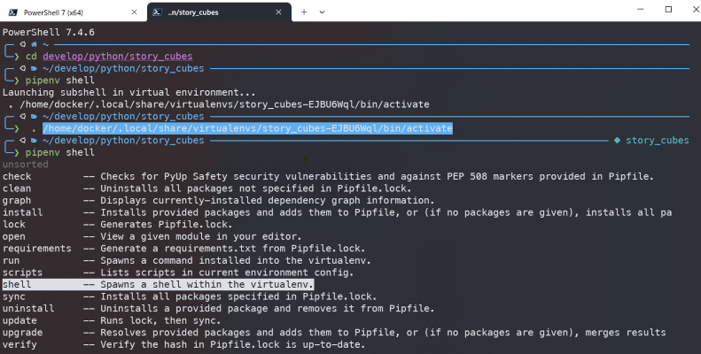
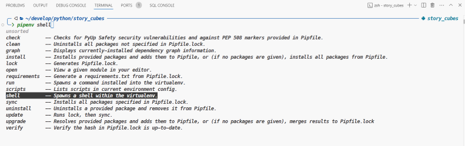
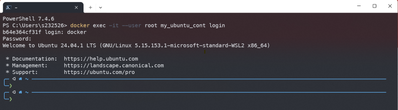
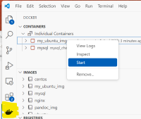
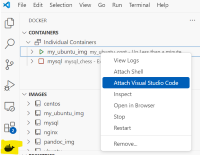

# A dockerized Python Development Environment

This summerizes my notes during playing with docker, building an ubuntu environment.

## Motivation

On our Window PC, we like to have an Linux environment, for

- Unix file management workflow, 
- scripting and 
- Python development. 

We will not use WSL neither WSL2, but Docker - this, we can transfer to another host system - to provide an image and a container that offer a Linux environment, with

- TTY only
- work as a user, e.g. _docker_, including _sudo_ rights
- with its home directory _/home/docker_
- that _/home/docker_ shall be directly accessible from the host system's native tools, e.g. via _File Explorer_: 
  - at a defined directory, by docker bind or volume (_works__)
  - at a Windows drive letter, by Unix Samba (_t.b.d._)
- the environment shall be usable via _VScode_ and _Windows PowerShell_
- use _zsh_ a shell, including _auto_complete_ & _auto_suggestion_
- provide fancy prompt with _p10k_ and font _MesloLGS Nerd Font Mono_





## Installation

Let us create a docker image from **_ubuntu_**, so that docker will provide a docker container that we can use as our Python Development Environment and some Unix Scripting. 

### Prerequisites - installation on local host OS (e.g. Windows):

1. Docker Desktop 
   - for Windows see: [Install Docker Desktop on Windows](https://docs.docker.com/desktop/install/windows-install/)
   - for Mac, see: [Install Docker Desktop on Mac](https://docs.docker.com/desktop/install/mac-install/)
   - for Linux, see: [Install Docker Desktop on Linux](https://docs.docker.com/desktop/install/linux/)
2. VScode, see: [Download Visual Studio Code](https://code.visualstudio.com/download)

Define some folders for our working environment by chosing any folder at your host machine OS (e.g. Windows) and create a structure like:

```shell no-copy
PythonEnv_with_Ubuntu_Docker/
|-- .dockerignore
|-- Dockerfile
\-- README.md

home_docker/       # anywhere at your host
| 
|   **************************************
|   * This is the                        *
|   *    my_ubuntu_cont: /home/docker/   *
|   *    --> host: home_docker/          *
|   **************************************
```

The _ubuntu_cont_ with its user _docker_ will use a dedicated _bind_ volume, i.e. the users directory _/home/docker/_ that is linked to the host's OS (e.g. Windows) directory _home_docker/_.

### Build a new image with a _Dockerfile_

1. Go to directory with _Dockerfile_, e.g. _docker/ubuntu/_

    ```shell no-copy
    PythonEnv_with_Ubuntu_Docker/      # go here
    |-- .dockerignore
    |-- Dockerfile
    \-- README.md
    ```

2. check the content of the _Dockerfile_:

    ```Dockerfile 
    FROM ubuntu:latest

    # see: https://stackoverflow.com/questions/36611052/install-pip-in-docker
    RUN DEBIAN_FRONTEND=noninteractive \
    apt-get update && apt-get -y install \
        zsh \
        git curl wget lynx \
        iputils-ping lshw net-tools \
        nano bc gawk htop eza fzf bat neovim stow \
        sudo \
        python3.12 python3-pip pipenv \
        tzdata \
        unminimize

    # correct timezone
    ENV TZ=Europe/Berlin
    RUN ln -snf /usr/share/zoneinfo/$TZ /etc/localtime && echo $TZ > /etc/timezone

    # --------------------------- user:passwd
    RUN useradd docker && echo "docker:docker" | chpasswd
    RUN usermod --shell /usr/bin/zsh -aG sudo docker
    RUN usermod --shell /usr/bin/zsh -aG sudo root
    # ------------------------------------- user:group
    RUN mkdir -p /home/docker && chown -R docker:docker /home/docker

    USER root
    RUN zsh
    ```

3. Build a new image _ubuntu_img_ and tag it (-t) with new image name:

    ```shell
    docker build -t ubuntu_img .   # notice the dot at the end
    ```

    You can see all images, with:

    ```shell
    docker image ls
    ```

    ```shell no-copy
    REPOSITORY    TAG    IMAGE ID     CREATED        SIZE
    mubuntu_img   latest daedc675771f 30 minutes ago 947MB
    ```


### Create a new container from the _ubuntu_img_ 

To create a container _ubuntu_cont_ for the user _docker_ that is at a directory of your host (e.g. Windows): Go to **host**'s directory  **_home_docker/** !!

```shell no-copy
PythonEnv_with_Ubuntu_Docker/
|-- .dockerignore
|-- Dockerfile
\-- README.md

home_docker/       # go here
| 
|   **************************************
|   * This is the                        *
|   *    my_ubuntu_cont: /home/docker/   *
|   *    --> host: home_docker/          *
|   **************************************
```

Proceed with **create** the container, if you are here: 

```shell no-copy
PS ...\docker\home_docker>
```

_for Windows PS or cmd prompt, a one-liner_

```PS
docker container create -it --name ubuntu_cont --user docker -v $PWD/:/home/docker ubuntu_img zsh
```

_for Unix/Mac cmd prompt, multiple lines_

```PS
docker container create -it \
    --name ubuntu_cont \
    --user docker \
    -v $PWD/:/home/docker \
    ubuntu_img \
    zsh
```

#### After installation tasks can be:

Changes in a running container will only stay as long as the container ist up and running. If you stop the container, that changes will be lost with the next re-start, but you can **commit** a container and build a new image from that container (see: [docker container commit](https://docs.docker.com/reference/cli/docker/container/commit/)), with this all your changes will stay.

Changes that are done in a volume or a bind location - as we do here for user docker - will stay and be there after re-starting the container.

1. You may **unminimize** the _ubuntu_ installation by

```PS
sudo unminimize
```

2. Sometimes you like to reconfigure the prompt, do so by

```PS
p10k configure
```

Ensure that the **_MesloLGS Nerd Font Mono_** ist configured at your **PS** and **VScode**
- **PS**: Go to Einstellungen > Standardwerte > Darstellung > Schriftart > set to: ```MesloLGS Nerd Font Mono```
- **VScode**: Goto File > Preferences > Settings > at "Search settings" input: Terminal:Integrated:Font > set to: ```MesloLGS Nerd Font Mono```

3. Oh-my-zsh and some plugins

    - see: [Oh-my-zsh](https://ohmyz.sh/)
    - see: [Oh my zsh - with some plugins](https://gist.github.com/n1snt/454b879b8f0b7995740ae04c5fb5b7df)


### Start a container

If you already have a container **_ubuntu_cont_**:
    
> **Note:**
>
> the container **_ubuntu_cont_** knows: it will use the volume, defined with
>
>   ```-v $PWD/:/home/docker```
>
>   or
>
>   ```-v home_docker_vol:/home/docker```
>
> so you do NOT need to start at a dedicated host's directory (as with step 1.)
>
    
**_Start_** _ubuntu_cont_ with 
```PS
docker start ubuntu_cont
```

If container is running: **exec** with **login**: 
```PS
docker exec -it ubuntu_cont login
```

  


#### Alternatives, but **NOT prefered** - use existing container **_ubuntu_cont_**
   
After **_ubuntu_cont_** is running, you can **attach** to, with: ```docker attach ubuntu_cont``` and your prompt will show:

```shell no-copy
PS ... \docker\home_docker> docker start ubuntu_cont
ubuntu_cont
PS ... \docker\home_docker> docker attach ubuntu_cont
╭─ ∅ / ───────────────────────────────────────────────────────────────── 
╰─❯ cd
╭─ ~ ─────────────────────────────────────────────────────────────────── 
╰─❯    
``` 

1. Start the container from

   - PS or VScode Terminal prompt (aka command line) with: ```docker start ubunut_cont```
   
   - inside VScode: 

        

    ```shell no-copy
    PS ... \docker\home_docker> docker start ubuntu_cont
    ubuntu_cont
    ```
2. Attach - better **exec** - to a running container via

   - PS or VScode Terminal prompt (aka command line) with: ```docker attach ubunut_cont```
   
   - inside VScode: 

        

    ```PS no-copy
    PowerShell 7.4.6
    PS ... > docker start ubuntu_cont
    ubuntu_cont    
    PS ... > docker exec -it ubuntu_cont login
    e4215510551d login: docker
    Password: docker
    Welcome to Ubuntu 24.04.1 LTS (GNU/Linux 5.15.153.1-microsoft-standard-WSL2 x86_64)

    * Documentation:  https://help.ubuntu.com
    * Management:     https://landscape.canonical.com
    * Support:        https://ubuntu.com/pro
    ╭─   ~ ───────────────────────────────────────────────────────────────
    ╰─❯ <ENTER>
    ╭─   ~ ───────────────────────────────────────────────────────────────
    ╰─❯ 
    ```

## Create image from a container

Sometimes you like to make your own image from the container that you are working with - Google ```docker commit```

## Open Items:

```python
# TODO: 

# TODO: 
#       

```

